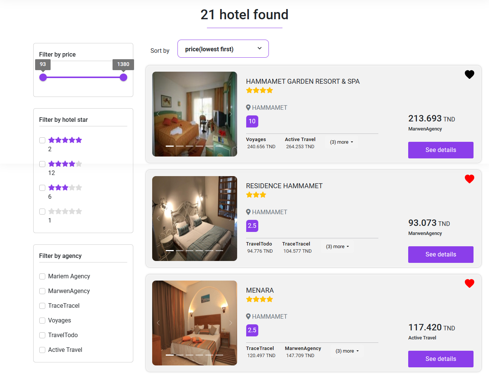

# Marketplace for travel agencies

This is my end of year project at my university ENET'com. 

## Overview

The Tourism Marketplace is a platform that connects travelers with travel agencies, providing a one-stop shop for travelers to find and compare travel deals. 
The platform offers a variety of features for both travelers and agencies
the website have three interfaces

## website interfaces
### For Travelers:
* A user-friendly search form to find travel deals
* The ability to compare prices for the same products across multiple sellers
* Filtering and sorting functionalities to find the ideal options
* A wish list to save hotels for later consideration

### For Agencies:
* Buy offers (providing the start date of the offer)
* manage his profile
* see statistics about his porducts performance in the marketplace

### For admin:
The admin interface provides functionality for managing:
* market subscription requests from sellers. 
* Cities and countries.
* Offers.
* Product types.
* Sellers and seller’s API’s.
* See statistics about the marketplace

## link to youtube
youtube video describing funcitons and features of the website: [Youtube video](https://www.youtube.com/watch?v=ORSIti3kAJU&ab_channel=YoussefKetata)

## screenshots

[other screenshots](./screenshot)

## Technology Stack
The Tourism Marketplace is built using the following technologies:
* Frontend: React and twig
* Backend: Symfony
* Database: MYSQL
